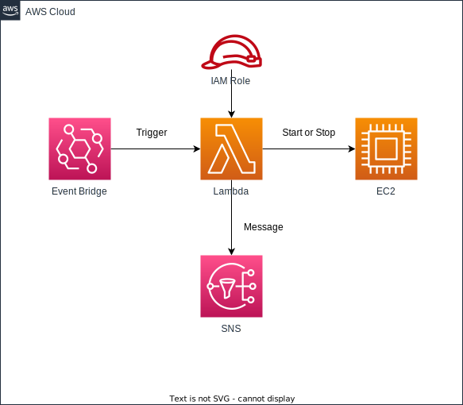

# ec2-auto-start-stop

日本語 | [English](README.md)

## 概要

このプロジェクトは、EC2をスケジュールに従って起動・停止するためのCDKアプリケーションです。

## アーキテクチャ



- Lambda関数：EC2を起動または停止する関数
- EventBridge：Lambda を起動するスケジュール

## 前提条件

- Node.js (>= 14.x)
- AWS CDK CLI (>= 2.x)
- AWS CLI（設定済み）

## デプロイ

```sh
npm run cdk:deploy:all --env=dev --project=hogehgoe -w workspaces\ec2-auto-start-stop
```

## 使用方法

なし

### 注意事項

このアプリケーションを使用する前に、適切なタグが設定されたEC2インスタンスがアカウントに存在することを確認してください。

### トラブルシューティング

問題が発生した場合は、以下を確認してください：

- Lambda関数のログ（CloudWatch Logs）

## ライセンス

このプロジェクトは Apache License 2.0 のもとで公開されています。詳細は [LICENSE](../../LICENSE) ファイルをご覧ください。
