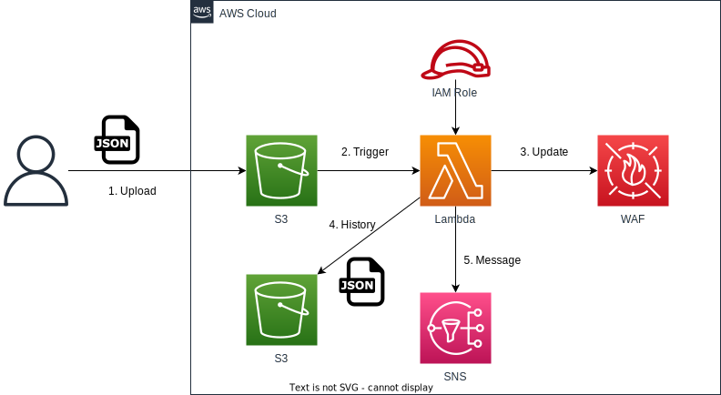

# waf-ip-whitelist-auto-updater

日本語 | [English](README.md)

## 概要

このプロジェクトは、AWS WAFのIPセット（ホワイトリスト）を自動的に更新するためのCDKアプリケーションです。S3バケットに設定ファイルをアップロードすることで、AWS WAFのIPセットを更新します。

## アーキテクチャ



- S3バケット：設定ファイルを格納
- Lambda関数：S3バケットにファイルがアップロードされたときにトリガーされ、WAFのIPセットを更新
- S3トリガー：S3バケットへのファイルアップロードを検知し、Lambda関数を起動

## 前提条件

- Node.js (>= 14.x)
- AWS CDK CLI (>= 2.x)
- AWS CLI（設定済み）
  - 接続プロファイル名は、デプロイコマンドに使用する`<project>-<env>`で作成しておきます。
    - project=sample env=devのときは、`sample-dev`となります。

## デプロイ

```sh
npm run cdk:deploy:all --env=dev --project=hogehgoe -w workspaces\waf-ip-whitelist-auto-updater
```

## 使用方法

1. 以下の形式のJSONファイルを作成：

```json
{
  "ipSetName": "YourIPSetName",
  "ipSetId": "YourIPSetId",
  "allowedIpAddressRanges": ["10.0.0.0/24", "192.168.1.0/24"],
  "scope": "CLOUDFRONT",
  "region": "",
  "isDebug": false,
  "snsTopicArn": "arn:aws:sns:region:account-id:topic-name"
}
```

2. このJSONファイルをデプロイされたS3バケットにアップロード。

3. Lambda関数が自動的にトリガーされ、指定されたWAF IPセットを更新

### 設定項目

- ipSetName: 更新するWAF IPセットの名前
- ipSetId: 更新するWAF IPセットのID
- allowedIpAddressRanges: 許可するIPアドレス範囲のリスト
- scope: "CLOUDFRONT"または"REGIONAL"
- region: リージョナルスコープの場合、使用するリージョン（空白の場合、Lambda関数のリージョンを使用）
- isDebug: trueの場合、実際の更新を行わずログ出力のみ行う
- snsTopicArn: 結果通知用のSNSトピックARN（オプション）

### 注意事項

このアプリケーションを使用する前に、必ずAWS WAFのIPセットを事前に作成しておいてください。
セキュリティのため、S3バケットへのアクセス権限を適切に設定してください。

### トラブルシューティング

問題が発生した場合は、以下を確認してください：

- S3バケットへのアップロード権限
- Lambda関数のログ（CloudWatch Logs）
- WAF IPセットの存在と指定したIDの正確性

## ライセンス

このプロジェクトは Apache License 2.0 のもとで公開されています。詳細は [LICENSE](../../LICENSE) ファイルをご覧ください。
