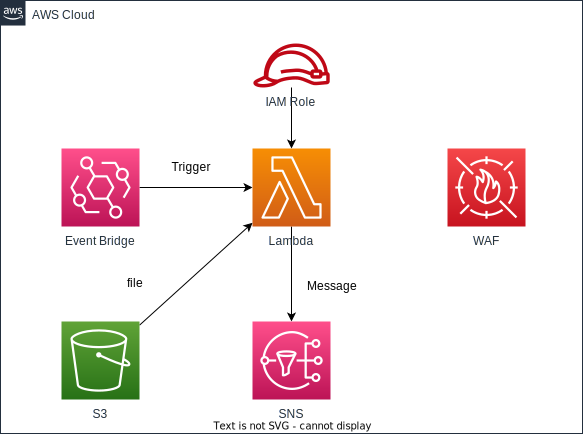

# waf-ip-whitelist-monitor

日本語 | [English](README.md)

## 概要

このプロジェクトは、AWS WAFのIPセット（ホワイトリスト）を自動的に更新するwaf-ip-whitelist-auto-updaterと連動してIPアドレスの棚卸ためのCDKアプリケーションです。S3バケットに保存されたIPセットの登録結果ファイルを読み取ってチェックします。

## アーキテクチャ



- Lambda関数：EventBridgeにトリガーされ、WAFのIPセットの登録内容をチェック
- EventBridge：Lambda を起動するスケジュール

## 前提条件

- Node.js (>= 14.x)
- AWS CDK CLI (>= 2.x)
- AWS CLI（設定済み）

## デプロイ

```sh
npm run cdk:deploy:all --env=dev --project=hogehgoe -w workspaces\waf-ip-whitelist-monitor
```

## 使用方法

なし

### トラブルシューティング

問題が発生した場合は、以下を確認してください：

- S3バケットへのアップロード権限
- Lambda関数のログ（CloudWatch Logs）
- WAF IPセットの存在と指定したIDの正確性

## ライセンス

このプロジェクトは Apache License 2.0 のもとで公開されています。詳細は [LICENSE](../../LICENSE) ファイルをご覧ください。
