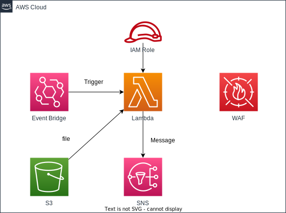

# waf-ip-whitelist-monitor

[日本語](README.ja.md) | English

WAF IP Whitelist Auto Updater

## Overview

This project is a CDK application that automatically updates IP sets (whitelists) in AWS WAF. It updates the AWS WAF IP set when a configuration file is uploaded to an S3 bucket.

## Architecture



- S3 Bucket: Stores configuration files
- Lambda Function: Triggered when a file is uploaded to the S3 bucket, updates the WAF IP set
- S3 Trigger: Detects file uploads to the S3 bucket and invokes the Lambda function

## Prerequisites

- Node.js (>= 14.x)
- AWS CDK CLI (>= 2.x)
- AWS CLI (configured)

## Usage

1. Create a JSON file with the following format:

```json
{
  "ipSetName": "YourIPSetName",
  "ipSetId": "YourIPSetId",
  "allowedIpAddressRanges": ["10.0.0.0/24", "192.168.1.0/24"],
  "scope": "CLOUDFRONT",
  "region": "",
  "isDebug": false,
  "snsTopicArn": "arn:aws:sns:region:account-id:topic-name"
}
```

2. Upload this JSON file to the deployed S3 bucket.

3. The Lambda function will automatically trigger and update the specified WAF IP set.

### Configuration Parameters

- ipSetName: Name of the WAF IP set to update
- ipSetId: ID of the WAF IP set to update
- allowedIpAddressRanges: List of IP address ranges to allow
- scope: "CLOUDFRONT" or "REGIONAL"
- region: Region to use for regional scope (if blank, uses Lambda - function's region)
- isDebug: If true, only logs output without making actual updates
- snsTopicArn: ARN of SNS topic for result notifications (optional)

### Important Notes

Ensure you have created the AWS WAF IP set before using this application.
Properly configure access permissions to the S3 bucket for security.

### Troubleshooting

If you encounter issues, check the following:

- Upload permissions for the S3 bucket
- Lambda function logs (in CloudWatch Logs)
- Existence of the WAF IP set and accuracy of the specified ID

## License

This project is released under the Apache License 2.0. See the [LICENSE](../../LICENSE) file for details.
